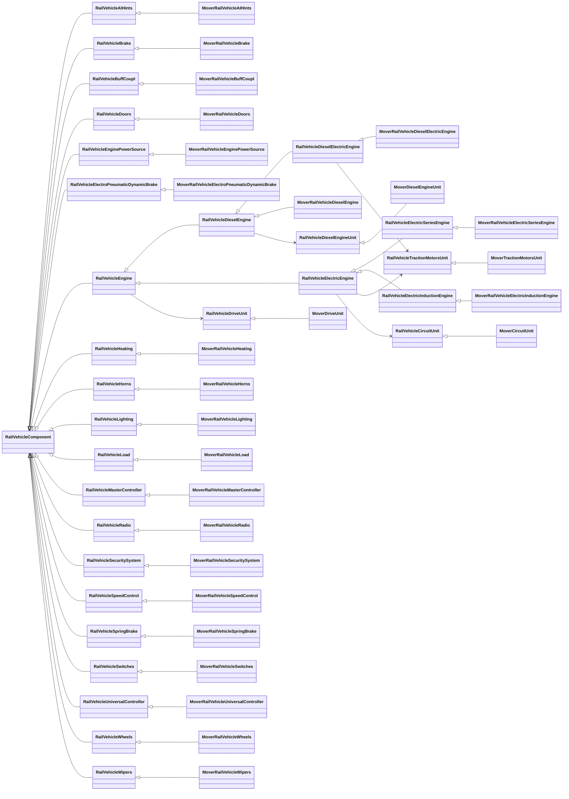

The MaSzyna project's vehicle simulation, implemented mostly as a
[Mover.cpp](https://github.com/eu07/maszyna/blob/master/McZapkie/Mover.cpp)
with surrounding classes, is appreciated all over the world.
Wrapping the original MaSzyna's physics is a core concept of making
a successful port of the simulator.

The goal is to expose internal MOVER's state and configuration through the wrapper's own vehicle interfaces - typed,
documented and named in a user-friendly and standardized way - so that nothing outside a thin implementation layer
knows the Mover is there. The vendored Mover lives in `src/legacy/maszyna-mover` and is never modified.

## Overall architecture

A vehicle is three layers, and only the last one knows the Mover:

1. **The proxy in the scene tree.** `VehiclePhysicsNode` is the vehicle's presence in the tree: it builds the vehicle
   from a copy of its description (a `VehicleController` with its components), owns its `VehicleServer` handle (RID)
   and frees both with itself. It holds no state and no simulation. `MaszynaRailVehiclePhysicsNode` (GDScript) only supplies
   the description, parsed from a `.fiz`.
   `GenericVehicleComponentNode` is a second proxy, through which a script adds its own component to the vehicle it
   sits under.
2. **The vehicle, behind a RID.** `VehicleController` and the `VehicleComponent`s it is made of are `Resource`s -
   their properties are the stored configuration, so a parsed vehicle is saved as it is - held through
   `VehicleServer`, stepped by their implementation once per rendered frame and commanded through the server. Each kind of
   component is an **interface**: `RailVehicleDoors`, `RailVehicleBrake`, ... - authored configuration as properties,
   live state as typed getters, operations as methods and commands. An interface names no backend.
3. **The implementation on the Mover.** `MoverRailVehicleController` creates and ticks the `TMoverParameters`;
   every `MoverRailVehicle<X>` implements the `RailVehicle<X>` interface on it (`src/legacy/vehicles`). These are
   the only classes that include `MOVER.h`.

Which implementation a vehicle is built with is chosen once, by the classes of its description: the FIZ parser
creates `MoverRailVehicleController` and the `MoverRailVehicle<X>` components, and a vehicle with no description
gets the controller class `register_types.cpp` names (`VehiclePhysicsNode::set_controller_implementation`).

Responsibility of each layer:
- proxy node: integration with Godot's engine through the Scene Tree; the handle; building and rebuilding the
  vehicle from a model; hosting a modder's script
- interface: the readable configuration that replaces FIZ keys; enums; the commands of the High-Level API; live
  state as typed properties; signals
- implementation: writing the configuration into the Mover the way its `LoadFIZ_*` would; wrapping its operations
  and its per-step updates; reading its state back

### Class diagrams

The overview - the proxy chain from the scene tree to the Mover, with doors as the example component:

```mermaid
classDiagram
    direction LR
    namespace SceneTree {
        class RailVehicle3D
        class VehiclePhysicsNode
        class MaszynaRailVehiclePhysicsNode
        class GenericVehicleComponentNode
    }
    namespace Model {
    }
    namespace Vehicle {
        class VehicleServer
        class RailVehicleServer
        class VehicleController
        class RailVehicleController
        class VehicleComponent
        class RailVehicleComponent
        class GenericVehicleComponent
        class RailVehicleDoors
    }
    namespace Mover {
        class MaszynaMoverVehicleServer
        class MoverRailVehicleController
        class MoverComponent
        class MoverRailVehicleDoors
        class TMoverParameters
    }
    VehiclePhysicsNode <|-- MaszynaRailVehiclePhysicsNode
    MaszynaRailVehiclePhysicsNode ..> VehicleController : parses .fiz into a description
    VehiclePhysicsNode ..> VehicleController : builds a copy of the description
    VehiclePhysicsNode *-- VehicleController : owns
    VehiclePhysicsNode --> VehicleServer : vehicle and controller RIDs
    VehicleServer o-- VehicleController : configures, binds, commands
    VehicleServer --> MaszynaMoverVehicleServer : hands it the step
    MaszynaMoverVehicleServer --> RailVehicleServer : rail work per vehicle, in its phases
    RailVehicle3D --> VehiclePhysicsNode : draws
    GenericVehicleComponentNode *-- GenericVehicleComponent : proxy of
    VehicleController <|-- RailVehicleController
    RailVehicleController <|-- MoverRailVehicleController
    VehicleController *-- VehicleComponent : components
    VehicleComponent <|-- RailVehicleComponent
    VehicleComponent <|-- GenericVehicleComponent
    RailVehicleComponent <|-- RailVehicleDoors
    RailVehicleDoors <|-- MoverRailVehicleDoors
    MoverComponent <|-- MoverRailVehicleDoors
    MoverComponent --> MaszynaMoverVehicleServer : takes the Mover from
    MoverRailVehicleController --> MaszynaMoverVehicleServer : takes the Mover from
    MaszynaMoverVehicleServer *-- TMoverParameters
```

The components - every interface with its Mover implementation. `RailVehicleEngine` and
`RailVehicleElectricEngine` are abstract. An engine is composed of units - plain C++ interfaces in
`src/vehicles/rail/`, each implemented on the Mover in `src/legacy/vehicles/` and installed by the
Mover engine that owns it: the drive in every engine, the diesel engine in the diesel and
diesel-electric ones, the traction motors in the electric and diesel-electric ones, the current
collector and the traction circuit in the electric ones. Godot sees only the engine components:



Every `MoverRailVehicle<X>` also inherits `MoverComponent` (see the overview), left out here for readability.

## Mapping key elements to a new architecture

| Element                       |MaSzyna EU07                         | MaSzyna: Reloaded
|-------------------------------|-------------------------------------|------------------------------------------
| Vehicle data container        | FIZ files                           | the vehicle's description - a `MoverRailVehicleController` resource with its components - parsed from the `.fiz` (`FizVehicleBuilder`, `addons/libmaszyna/legacy/fiz`)
| Vehicle data loading + init   | cParser + Mover's `LoadFIZ_*()`     | Component properties + `_apply_configuration()` of the `Mover*` implementation
| Reading vehicle state         | Direct access to Mover's properties | Typed getters of the component; `vehicle_dump_state()` for diagnostics
| Modyfing vehicle state        | Direct calls to Mover's methods     | `VehicleServer.vehicle_send_command()`; typed calls on a component only within the vehicle's own composition ([Commands and method calls](architecture.html#commands-and-method-calls))
| Reading runtime config values | Direct property reading or calls    | `Dictionary` with a runtime config (`vehicle_dump_config()`, `config_changed`)
| Propagating trainset commands | Internal notification + TTrain refs | Using High-Level API commands

## Adding a component

A logical subset of Mover's functionality is wrapped as a pair of classes plus a parser:

* **the interface** `RailVehicle<X> : RailVehicleComponent` in `src/vehicles/rail`:
  * the authored configuration as properties, with defaults (see below) and a setter/getter pair each
  * public enums, bound (`VARIANT_ENUM_CAST`, `BIND_ENUM_CONSTANT`)
  * live state as pure virtual typed getters, operations as pure virtual methods, both bound
  * `get_component_type()` returning its `VehicleComponentType`
  * `_register_commands()` and `_unregister_commands()`
  * signals, if necessary; for internal communication
  * **no Mover** - not in a method name, a parameter, a type or an include
* **the implementation** `MoverRailVehicle<X> : RailVehicle<X>, MoverComponent` in `src/legacy/vehicles`:
  * `_implementation_changed()` taking the vehicle's Mover (`take_mover()`) - handed over when its
    simulation starts, taken back before the Mover is freed
  * `_apply_configuration()`, `_do_process_component()`, the live getters and the operations over `get_mover()`
  * `_fill_state_dictionary()` and `_fill_config_dictionary()`, if necessary
* **the parser** `Fiz<...>Parser` in `addons/libmaszyna/legacy/fiz`: reads the FIZ section and sets the properties
  of a new `MoverRailVehicle<X>`

#### **`VehicleComponent::_apply_configuration()`**

Writes the component's properties into the Mover. It is an equivalent of Mover's `LoadFIZ_*` methods and must
follow the same logic, defaults included. It runs when the vehicle's simulation has been created and configured
(`VehicleController::simulation_configured_signal`), when a component joins a vehicle that is already running, and
after `mark_dirty()`. Every run is announced with the vehicle's `config_changed` signal.

`VehicleController::apply_configuration()` configures a vehicle in two passes. The first is every
`_apply_configuration()` - the controller's own `apply_config()`, then each component's, in the order of the FIZ
sections - and writes only what the component owns alone. The second is `apply_vehicle_config()`, run once all of
them are done: it writes what depends on another component (a bare coupler on the engine's maximum tractive force,
the speed control on the engine's kind), read from that component's properties. A value of another component is
never read in `_apply_configuration()`: there it depends on whether its section came first.

> NOTE: In the legacy game `LoadFIZ_*` logic was called just once while loading the scenery, so the state of a vehicle
> was always clean. MaSzyna Reloaded allows to re-configure vehicles at runtime, but the original Mover can produce
> unexpected results in such cases. A some "resetting" or re-initializing logic may be necessary to add here.


#### **Live state: typed getters**

State is not copied anywhere. Each getter reads the Mover when it is called:

```cpp
bool MoverRailVehicleDoors::get_locked() const {
    const TMoverParameters *mover = get_mover();
    return mover != nullptr ? mover->Doors.is_locked : false;
}
```

A getter never changes state - no filter step, no flag consumed, no signal. A value that has to be integrated over
time is advanced in `_do_process_component()` and only returned by the getter.


#### **`VehicleComponent::_fill_state_dictionary(Dictionary &state)`**

Writes the component's share of the vehicle dump (`vehicle_dump_state()`) from its typed getters. It is called only
when somebody asks for a dump - a console, a test, a diagnostic - never per frame.


#### **`VehicleComponent::_fill_config_dictionary(Dictionary &config)`**

Writes dynamic/precomputed Mover config values into `config`. The original Mover is mixing a vehicle state with its
characteristics like min/max values; these are split out to keep the state minimal. Example - the door permit preset
switch has one position per FIZ permit preset (`Train.cpp:7304`):

```cpp
void MoverRailVehicleDoors::_fill_config_dictionary(Dictionary &p_config) const {
    const TMoverParameters *mover = get_mover();
    if (mover == nullptr) {
        return;
    }
    p_config["doors_permit_preset_max"] = std::max(0, static_cast<int>(mover->Doors.permit_presets.size()) - 1);
}
```


#### **`VehicleComponent::_do_process_component(double delta)`**

One step of the component, called by the vehicle on every `RailVehicleServer` step. Use it to wrap game loop methods.

Example:

```cpp
void MoverRailVehicleDoors::_do_process_component(const double p_delta) {
    TMoverParameters *p_mover = get_mover();
    ASSERT_MOVER(p_mover);
    p_mover->update_doors(p_delta);
}
```


#### **`VehicleComponent::_register_commands()`**

Registers the commands the component answers to on its vehicle. It is called when the component joins the vehicle
(and when it is enabled again), in the interface class - the commands are the same whatever implements them.

> NOTE: Callbacks must be exposed to the Godot API via `ClassDB::bind_method()`

Example:

```cpp
void RailVehicleDoors::_register_commands() {
    register_command("doors_left_permit", Callable(this, "permit_left_doors"));
    register_command("doors_right_permit", Callable(this, "permit_right_doors"));
    register_command("doors_left", Callable(this, "operate_left_doors"));
    register_command("doors_right", Callable(this, "operate_right_doors"));
}
```

#### **`VehicleComponent::_unregister_commands()`**

Gives the commands back when the component leaves the vehicle or is disabled.

Example:

```cpp
void RailVehicleDoors::_unregister_commands() {
    unregister_command("doors_left_permit", Callable(this, "permit_left_doors"));
    unregister_command("doors_right_permit", Callable(this, "permit_right_doors"));
    unregister_command("doors_left", Callable(this, "operate_left_doors"));
    unregister_command("doors_right", Callable(this, "operate_right_doors"));
}
```

## Coding guidelines and limitations

### Which properties to wrap / expose

The goal is to build full compatibility with legacy exe, so:
* all handled properties of `FIZ` files must be mapped to component properties
* all methods used in command handles in the legacy `TTrain` must be wrapped as commands

But nothing more - Mover may contain unused code, which will be impossible to test.

### Naming conventions

#### Classes and attributes

* classes and enums should be properly prefixed: `RailVehicle<X>` for an interface, `MoverRailVehicle<X>` for its
  implementation
* keep consistency between names of attributes and setters/getters (`[set_|get_]some_value`):
  ```cpp
  int some_value = 0;

  void set_some_value(const int p_value);
  int get_some_value();
  ```
* property names exposed to Godot are `snake_case` without slashes; an inspector group goes to the grouping argument
  of `BIND_PROPERTY`, never into the name
* prefix setter arguments with `p_`
* avoid redundancy in names
* try to keep short names, but do not use abbreviations (readibility counts)
* add comments, but only where necessary

#### Vehicle state and config

* use new, readable names
* qualify every key by what owns it - `heating_enabled`, never a bare `enabled`
* a component that publishes a whole sub-device's block qualifies it with a namespace instead:
  `spring_brake/cylinder_pressure`, `current_collector/max_voltage`
* a key is the value's name, never the name of the accessor that produced it
* a key the vehicle's variant does not have is not written, so `has()` keeps its meaning
* use only `[a-z0-9_]`, plus `/` after a sub-device namespace

#### Commands

* use new, readable names
* use short names as possible (i.e. prefer `battery` over `battery_enable`)
* avoid the unclear combinations (i.e. `battery_toggle(false)` - toggle? or set/enable; or `battery_on("off")`)
* always prefix command names
* use only `[a-z0-9_]`

Example:

```gdscript

var state = {
    "battery_enabled": true,
    "battery_voltage": 110,
    "battery_damaged": false,

    "brakes_air_pressure": 0.5,
    "brakes_pipe_pressure": 0.5,

    "doors_locked": false,
    "doors_lock_enabled": false,

    "doors_left_open": true,
    "doors_left_remote_open": true,

    "doors_right_open": false,
    "doors_right_remote_open": false,
}
```

### Documentation

Documentation is important, because it is well integrated with Godot Editor. Well-documented classes, properties and
methods are available in the editor in a built-in documentation browser, tooltips and code completion/hinting. **Always
check the documentation before merging a pull-request**, and try to do the best before submitting a PR.

The goal of this project is also to clean up naming, so wrapped properties may have different names than in MOVER and
FIZ files. That's why is very important to add a FIZ property name to properties description using this syntax:

```
[code]<FIZ Section>:<FIZ property name>[/code]
```

Example (`doc_classes/RailVehicleDoors.xml`):

```xml
<member name="open_method" type="int" setter="set_open_method" getter="get_open_method" enum="RailVehicleDoors.Controls" default="0">
    [code]Doors:OpenCtrl[/code]
    Determines method of opening doors
</member>
```
> Check: [OpenCtrl in Doors section](https://wiki.eu07.pl/index.php/Plik_charakterystyki#Doors:_.28Sekcja_drzwi.29)

This will help users to recognize properties.

Summing up:
* keep the docs up to date
* add `[code]` blocks for refrerincing `FIZ` properties

### Default values

In some cases handing defaults can be tricky, but they're crucial for compatibility. **Every property of a component
wrapping Mover must have a proper default value set**. Many FIZ files from the MaSzyna's data pack has no values set
explicitely, so some vehicle's properties are just working defaults or they are precomputed by Mover during parsing FIZ
files.

To handle defaults properly:
* check [MOVER.h](https://github.com/eu07/maszyna/blob/master/McZapkie/MOVER.h) declaration
* check realated `LoadFIZ_*` section in the
  [original sources](https://github.com/eu07/maszyna/blob/master/McZapkie/Mover.cpp)
* if there are non-simple defaults, introduce some "unspecified" default value and add extra logic (see example for
  enums)
* the FIZ parser sets a property only when its key is present in the file, so an absent key leaves the default

### Enums

* Exposing Mover's internal enums is prohibited
* Mixing Mover's enums with new ones is prohibited
* Must be exposed to Godot API (`VARIANT_ENUM_CAST`, `BIND_ENUM_CONSTANT`)
* Must start from `0` and be consecutive integers (0, 1, 2, ... and so on)
* Must be properly matched with `PROPERTY_HINT_ENUM` - build the hint string with `enum_hint()` (`macros.hpp`) from
  the real constants, not from hand-typed labels
* Must be properly mapped to Mover's enums - the mapping belongs to the `Mover*` implementation
* Must be defined in a public class scope of the interface
* Names and item names must be unique in a class scope
* Should be documented
* Should be introduced where original Mover is missing enums


#### RailVehicleDoors::Voltage enum example

Definition in the interface's header file:

```cpp
namespace godot {
    class RailVehicleDoors : public RailVehicleComponent { // class scope
        public: // must be public
            enum Voltage { // unique name in the class scope
                VOLTAGE_AUTO, // unique enum item names in a class scope (!)
                VOLTAGE_0,
                VOLTAGE_12,
                VOLTAGE_24,
                VOLTAGE_112,
            };
    };
}

VARIANT_ENUM_CAST(RailVehicleDoors::Voltage)
```

Binding enum items in `cpp` file:

```cpp

namespace godot {
    void RailVehicleDoors::_bind_methods() {
        BIND_ENUM_CONSTANT(VOLTAGE_AUTO)
        BIND_ENUM_CONSTANT(VOLTAGE_0)
        BIND_ENUM_CONSTANT(VOLTAGE_12)
        BIND_ENUM_CONSTANT(VOLTAGE_24)
        BIND_ENUM_CONSTANT(VOLTAGE_112)
    }
}
```

Declaration of the property with its default:

```cpp

namespace godot {
    class RailVehicleDoors : public RailVehicleComponent {
        // ...
        private:
            // setting VOLTAGE_AUTO as default is very important here!
            Voltage voltage = Voltage::VOLTAGE_AUTO;

        public:
            void set_voltage(Voltage p_voltage);
            Voltage get_voltage() const;
        // ...
    }
}
```

Mapping the `Voltage` enum to Mover's internal values (for this property Mover has no enum defined) is the
implementation's business, so it lives in `MoverRailVehicleDoors`:

```cpp
namespace godot {
    class MoverRailVehicleDoors : public RailVehicleDoors, public MoverComponent {
        private:
            // notice missing VOLTAGE_AUTO - it can't be mapped
            const std::map<Voltage, float> voltage_map = {
                    {VOLTAGE_0, 0.0f}, {VOLTAGE_12, 12.0f}, {VOLTAGE_24, 24.0f}, {VOLTAGE_112, 112.0f}};
    };
};
```

The final conversion:
* is an **one-way conversion**: from the component property to Mover's attribute,
* it **must** be implemented with a same logic as in Mover's `LoadFIZ_*` section,
* it **must handle default value**: a case, when `DoorVoltage` property is not declared in a `FIZ` file

The original code looks like:
```cpp

void TMoverParameters::LoadFIZ_Doors(std::string const &line) {
    // ...

    {
        auto const remotedoorcontrol {
            ( Doors.open_control == control_t::driver )
         || ( Doors.open_control == control_t::conductor )
         || ( Doors.open_control == control_t::mixed ) };

        extract_value( Doors.voltage, "DoorVoltage", line, ( remotedoorcontrol ? "24" : "0" ) );
    }

    // ...
}
```

The code above is trying to extract `DoorVoltage` value and store it in `Doors.voltage` attribute. But in case when
`DoorVoltage` is not defined in `FIZ` file or has no value set, `24V` will be used if doors are remotely controlled,
`0V` otherwise.

The logic above **must** be re-implemented in `_apply_configuration()`. To do it properly a case when value is not
set in the `FIZ` file must be handled properly, beacuse Mover is doing some extra checks and **finally handles two
possible default values**, depending on the other properties (`Doors.open_control` here).

Note that component properties keep their defaults when the FIZ parser does not set them. In most cases it is good
enough to set a default value of the attribute to the same value as declared in `MOVER.h` or `extract_value()`'s
default argument. But in the `DoorVoltage` case we have two possible defaults!

Knowing that, the default value for the property can't be set to "well-known" value like  `VOLTAGE_0`
(as in `MOVER.h` original header), because `0V` is a value which will be converted to `0` through `voltage_map`, and
the custom logic for setting a default value will not be executed. So there is necessity to **identify an "unspecified"
state**, and that's why **`VOLTAGE_AUTO` enum was introduced and set as a default**.

```cpp

void MoverRailVehicleDoors::_apply_configuration() {
    TMoverParameters *p_mover = get_mover();
    ASSERT_MOVER(p_mover);
    // ...

    bool const remote_control = {
            (get_open_method() == CONTROLS_DRIVER || get_open_method() == CONTROLS_CONDUCTOR ||
             get_open_method() == CONTROLS_MIXED)};

    if (voltage_map.find(get_voltage()) != voltage_map.end()) {
        // use well-known mapped values
        p_mover->Doors.voltage = voltage_map.at(get_voltage());
    } else {
        // handle "unspecified" case here
        p_mover->Doors.voltage = remote_control ? 24 : 0; // no enums in the Mover
    }

    // ...
}
```

### Flags

Readable on both sides - a hard requirement. A Mover bitmask whose bits combine (`coupling::`,
`bdelay_*`, damage flags) is a bitfield enum of the interface, with its own bits - never the
Mover's enum:

* C++ takes and returns `BitField<Enum>`; the constants are bound with `BIND_BITFIELD_FLAG`
  (`RailVehicleController::CouplingFlags`)
* GDScript holds such a value **typed with that enum** - a variable, a parameter, a return or a
  `const` composed of the named constants (`var coupler:RailVehicleController.CouplingFlags`) -
  never an `int`, a bare number or a `const ...:int`
* a number out of the data (the scenery's `Shunt -3 -99`) becomes the enum type once, where it is
  read (`as RailVehicleController.CouplingFlags`)
* what is printed or asserted names the flags, not the number

### Command callbacks

Commands are registered and unregistered in `_register_commands()` and `_unregister_commands()` of the interface.
Because command callbacks are created in a runtime, they must be exposed to the Godot API as public methods.

A smart approach is to define public methods that can be called in internal communication within the High-Level
Component. The interface declares them, the implementation carries them out on the Mover:

```cpp
void MoverRailVehicleDoors::operate_doors(const Side p_side, const bool p_state) {
    TMoverParameters *mover = get_mover();
    ASSERT_MOVER(mover);
    mover->OperateDoors(p_side == Side::SIDE_LEFT ? side::left : side::right, p_state);
}

void MoverRailVehicleDoors::operate_left_doors(const bool p_state) {
    this->operate_doors(Side::SIDE_LEFT, p_state);
}

void MoverRailVehicleDoors::operate_right_doors(const bool p_state) {
    this->operate_doors(Side::SIDE_RIGHT, p_state);
}
```

And the registration, in the interface:

```cpp
void RailVehicleDoors::_register_commands() {
    register_command("doors_left", Callable(this, "operate_left_doors"));
    register_command("doors_right", Callable(this, "operate_right_doors"));
}
```

> NOTE: Method `operate_doors` is not exposed as a command, but due to this technique it is available as a typed
> call on the component - handy in internal communication, between the components of one vehicle. Anything outside the
> vehicle sends the command: only the command renews the state dump and is announced
> ([Commands and method calls](architecture.html#commands-and-method-calls)).

#### Argument type conversion

Godot uses `Variant` internally to transport variables of many types. Some of built-in types can be automatically casted
to primitives like `int` or `bool`, including enums (as they are plain `ints`). The types conversion works well for most
cases, even for `String`-type arguments passed to the command.

But for some cases it could introduce some problems, like for casting `String` to `bool`, where `bool("0") -> true`.
In such cases a [custom conversion is required](https://github.com/MaSzyna-Reloaded/MaSzyna-API-wrapper/issues/42).

### Mover bugs

You will find bugs in Mover. But the goal is to achieve full compatibiliy, so you must allow them to live.
If it was broken, then it must be still broken. Do not fix Mover (do not touch the original code). Do not implement
workarounds. [Report issue here](https://github.com/eu07/maszyna/issues) instead.

Where the wrapper has to reproduce a quirk of the original for the data to work, the quirk lives in a factory (a FIZ
parser, an importer) or in a `Mover*` / `MaszynaLegacy*` class - never in a `RailVehicle*` interface or a base class.
Known quirks are listed in `MASZYNA_ORIGINAL_QUIRKS.md`.

### Simulation steps vs. render frames

The original engine updates everything within one simulation step: producers (e.g. `TTractionPowerSource::Update()`)
and their consumers (e.g. pantographs calling `TTraction::VoltageGet()` from `TDynamicObject`) always run in the same
step, the producers first (`simulation.cpp:115-116`). This wrapper keeps that order: `TractionServer` ticks its power
sources on `SimulationServer`'s `simulation_advanced`, connected before `VehicleServer`, so every slice ticks the
sources and then steps the vehicles that draw from them (`wire_draw_current()`) and read their voltage
(`wire_get_voltage()`).

A producer ticked on another beat than its consumers breaks ported per-step state. Real case: `TractionServer` once
ticked from `process_frame` while the loads asked from the vehicle step; a tick without any pantograph asking left the
source at "no load", the next query returned 0 V, Mover's `NoVoltRelay` saw a loss of voltage and tripped the line
breaker - randomly while driving and every time the player left the cabin. Keeping the previous load covered it; the
fix is the order above.

Related pitfall: port the original's exact comparisons literally (`x != 0.0` as `not x == 0.0`), not with
`is_zero_approx()` - its tolerance (1e-5) swallowed the tiny non-zero value the port used as a "no load" floor and
turned it into a real zero.


